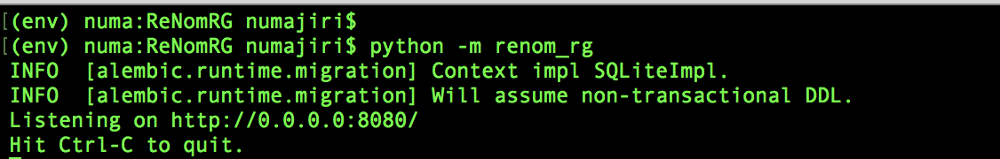

# ReNomRG 0.3.0 beta

ReNom RG is model developing tool for regression using Graph CNN.

notice: Time series data is not supported in current version.

### ReNomRG
https://www.renom.jp/packages/renomrg/index.html

## Recommended Environment
- OS: Ubuntu 16.04
- Browser: Google Chrome(version 63.0.3239.132)
- Python: >=3.6

## Install
ReNomRG requires ReNom.

If you haven't install ReNom, please install ReNom from  https://github.com/ReNom-dev-team/ReNom.git.

Please refer to the ReNom installation below.  
https://www.renom.jp/packages/renomdl/rsts/installation/installation.html

### Install ReNomRG package
Linux user can install ReNomRG from Wheel package.

Other os user can't install from Wheel package but can install from source.

The Wheel package is provided at:

`https://grid-devs.gitlab.io/ReNomRG/bin/renom_rg-VERSION-py3-none-any.whl`

(VERSION is stands for actual version number e.g. 0.0.1, 0.1b1(beta version), 0.2b0(beta version), 0.3b0(beta version))

You can install the wheel package with pip command::

`pip install https://grid-devs.gitlab.io/ReNomRG/bin/renom_rg-0.3b0-py3-none-any.whl`

### Install from source
For installing ReNomRG, download the repository from following url.

`git clone https://github.com/ReNom-dev-team/ReNomRG.git`

And move into ReNomRG directory.
`cd ReNomRG`

Then install all required packages.

`pip install -r requirements.txt`

At last, build extension modules.

`python setup.py build`

And install renom_rg module using following command.

`pip install -e .`

## How to use

### How to start

1.Type following command in ReNomRG directory.

`python -m renom_rg`

or

`renom_rg`

Second command can be called in any directory and creates `datasrc`, `storage`, `scripts` and `alembic` directories and `alembic.ini` file in current directory.
Please set your data to the created directory.

For the command renom_rg, you can give following arguments.

- –-host : This specifies server address.
- –-port : This specifies port number of the server.

`renom_rg --port 8888  # Running ReNomRG with port 8888`

If the server starts, you will see a message like below.



Then 'datasrc' directory will be created in your current directory.
Please set pickle data according to `Where to put your data` description.

### Where to put your data

When the server starts, `datasrc`, `storage`, `scripts` and `aelmbic` directory and `alembic.ini` file are created in current directory.

The directory structure is below.

```
<server_start_directory>
    └── alembic.ini        // database setting file.
    └── alembic
    |   └── versions       // database migration files.
    |   └── env.py         // database environment file.
    └── storage
    |   └── storage.db     // default database(sqlite3).
    |   └── trained_weight // weights for regression models.
    └── datasrc
    |   └── data.pickle    // pickle data for train & validation.
    |   └── prediction_set
    |       └── pred.pickle // pickle data for prediction.
    └── scripts
        └── userdefmodel.py // scripts for user defined model.
```

The data that can be read with ReNomRG beta must be named "data.pickle" and "pred.pickle".

### Format of input data.

The format of input file is pickled pandas.DataFrame object.

### Detail.

The detail of how to use is refer follow.  
https://www.renom.jp/packages/renomrg/rsts/how_to_use.html

## Change log

### v0.2.0 beta => v0.3.0 beta

- After completion of model creation, the importance of each explanatory variable can be checked.
- Random Forest and XGBoost were added to the algorithm selection item at model creation.

### v0.1.0 beta => v0.2.0 beta

- Explanatory variables and target variables can be selected when creating a dataset.
- Feature Scaling can be selected when creating a dataset.
- The prediction result can be saved as CSV data.

### v0.0.0 beta => v0.1.0 beta

- GraphCNN is possible with GPU.
- Enabled install with wheel.
- Enabled starting server from current directory.
- Enabled training user defined model from GUI.
- Added regressor module that can pull model to python script from GUI server.

## License

“ReNomRG” is provided by GRID inc., as subscribed software.  By downloading ReNomRG, you are agreeing to be bound by our ReNom Subscription agreement between you and GRID inc.
To use ReNomRG for commercial purposes, you must first obtain a paid license. Please contact us or one of our resellers.  If you are an individual wishing to use ReNomRG for academic, educational and/or product evaluation purposes, you may use ReNomRG royalty-free.
The ReNom Subscription agreements are subject to change without notice. You agree to be bound by any such revisions. You are responsible for visiting www.renom.jp to determine the latest terms to which you are bound.
